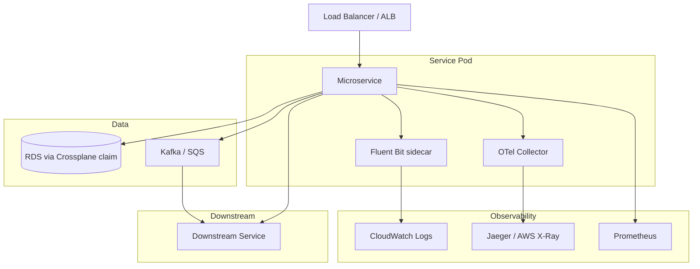

# TCS Microservices Blueprint

**Maturity:** Beta | **Owner:** Platform Team | `tcs.io/maturity: beta`

This blueprint defines patterns and standards for building microservices within the TCS platform. It is language-agnostic and complements the golden path templates (Node.js, Python). Use it as the reference during code reviews and architectural decisions.

## Architecture Overview



## Communication Patterns

### Synchronous - REST over HTTPS

All synchronous service-to-service communication uses REST over HTTPS. An OpenAPI spec (v3.0+) is required for every public API endpoint.

- API entities in the Backstage catalog must reference the OpenAPI spec via `backstage.io/definition-at`
- Services consume downstream APIs via their published OpenAPI contracts, not internal knowledge
- No direct database sharing between services

### Asynchronous - Kafka / SQS

For event-driven and decoupled communication:

- **Kafka** - preferred for high-throughput event streaming. An AsyncAPI spec is required for Kafka topics.
- **SQS** - preferred for simpler point-to-point async patterns on AWS

**gRPC is deferred to v2 of this blueprint.** Client tooling maturity across the portfolio is insufficient to standardize on it now.

## Observability

Every service must expose all three observability pillars from day one.

### Metrics

Expose a Prometheus-compatible `/metrics` endpoint. Use the OpenTelemetry SDK metrics API or a Prometheus client library for your language. The `/metrics` endpoint must be accessible by the cluster's Prometheus scraper (not exposed via the external load balancer).

### Tracing

Instrument with the OpenTelemetry SDK. The export target (Jaeger, AWS X-Ray, Tempo) is client-specific and configured via environment variables at deploy time. Do not hardcode the exporter - use the OTLP exporter with `OTEL_EXPORTER_OTLP_ENDPOINT` so the destination is swappable.

### Logs

Emit structured JSON to stdout. Do not write to files. Fluent Bit (DaemonSet or sidecar, client-specific) ships logs to CloudWatch or equivalent. Required fields per log line:

```json
{
  "timestamp": "ISO8601",
  "level": "info|warn|error",
  "service": "service-name",
  "trace_id": "otel-trace-id",
  "message": "human readable message"
}
```

## Deployment

### Containerization

All services must be containerized. Use the golden path Dockerfile as the starting point. Requirements:

- Multi-stage build (builder + runner stage)
- Non-root user in the runner stage
- Minimal base image (alpine variants)
- `HEALTHCHECK` instruction

### Helm Chart

Use the golden path Helm chart. Minimum requirements for production:

- `replicaCount: 2` (minimum - use HPA for scaling)
- HPA with `minReplicas: 2` and `maxReplicas` appropriate for the service
- Resource `requests` and `limits` defined
- Liveness and readiness probes configured
- `PodDisruptionBudget` with `minAvailable: 1`

### Kubernetes Requirements

- Readiness probe: service only receives traffic when ready
- Liveness probe: pod is restarted if the service enters a broken state
- Resource requests/limits: every container must define both. Services without limits risk starving neighbors during load spikes.

## Security

### Secrets Management

**Never put secrets in environment variables defined in Helm values or Kubernetes manifests.** Use one of:

- AWS Secrets Manager (preferred on AWS) - mount via External Secrets Operator
- HashiCorp Vault - mount via Vault Agent sidecar or CSI driver

The `catalog-info.yaml` may include `tcs.io/secrets-backend: aws-secrets-manager` to document the approach.

### mTLS

mTLS between services is recommended. Implementation is client-specific:

- **With a service mesh** (Istio, Linkerd, AWS App Mesh): mTLS is handled by the mesh sidecar transparently
- **Without a service mesh**: use cert-manager to provision and rotate certificates

Do not prescribe the service mesh implementation - use what the client already operates.

### IAM

Each service must have a dedicated IAM role (via IRSA on EKS) with least-privilege permissions. No shared IAM roles across services.

## Catalog Requirements

Every service must have a `catalog-info.yaml` with all mandatory TCS annotations. See [service-catalog-entities.md](https://github.com/tata-consulting/platform/blob/master/docs/architecture/service-catalog-entities.md) for the full spec.

Services with public APIs must also have an `API` entity in the catalog referencing the OpenAPI spec.

## Related Resources

- [Node.js Golden Path Template](../../golden-paths/nodejs-microservice/)
- [Python Golden Path Template](../../golden-paths/python-microservice/)
- [Service Catalog Entity Design](https://github.com/tata-consulting/platform/blob/master/docs/architecture/service-catalog-entities.md)
