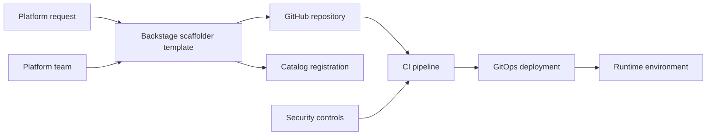

# Backstage blueprint flow

```mermaid
flowchart LR
    Request[Platform request] --> Template[Backstage scaffolder template]
    Template --> Repo[GitHub repository]
    Template --> Catalog[Catalog registration]
    Repo --> Pipeline[CI pipeline]
    Pipeline --> GitOps[GitOps deployment]
    GitOps --> Runtime[Runtime environment]
    PlatformTeam[Platform team] --> Template
    Security[Security controls] --> Pipeline
```

The blueprint starts in Backstage, creates a repository with the expected metadata, and then hands off to delivery automation.
